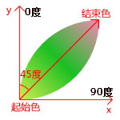

# CSS（层叠样式表）， 要补一下浮动，定位和before的笔记--
# 什么是CSS

CSS规则由两个主要的部分构成：选择器，以及一条或多条声明

CSS规则 = 选择器 + 声明块

声明总以大括号 {} 括起来，属性名和属性值组成,中间用 `:` 来连接,每一个属性由 `;` 来分割

**css只有行注释没有块注释**

# 引入CSS的方法

1. 行间样式-直接写在标签内部
2. 页面级css-写在 `<head>` 内
3. 外部css文件-使用 `<link>`

`link` 引入css时,浏览器异步加载(异步是同时的意思,计算机语言时反着的.相对的是同步)

## [font属性](https://developer.mozilla.org/zh-CN/docs/Web/CSS/font)

应用:用来作为 `font-style` , `font-variant` , `font-weight` , `font-size` , `line-height` 和 `font-family` 属性的简写，或将元素的字体设置为系统字体。

| 必须包含以下值|                  |
| :--|:-- |
| `<font-size>`          | 字体大小         |
| `<font-family>`        | 字体族名         |
| **可以选择性包含以下值**： |                  |
| `<font-style>`         | 字体样式         |
| `<font-variant>`       | 变形体(简写属性) |
| `<font-weight>`        | 字体粗细         |
| `<line-height>`        | 行高             |

- `font-style`, `font-variant` 和 `font-weight` 必须在 `font-size` 之前
- 在 CSS 2.1 中 `font-variant` 只可以是 `normal` 和 `small-caps`
- `line-height` 必须跟在 `font-size` 后面，由 "/" 分隔，例如 "`16px/3`"
- `font-family` 必须最后指定

### [font-size 属性](https://developer.mozilla.org/zh-CN/docs/Web/CSS/font-size)

应用:指定字体的大小。因为该属性的值会被用于计算 `em` 和 `ex` 长度单位，定义该值可能改变其他元素的大小。

计算方式:相对长度转换为绝对长度

设置的是字体的**高度**

当单位为 `em` 或 `ex` 时，大小为相对于父元素的文字的大小。例如，0.5em 就是当前元素的父元素的字体大小的一半。

## [font-weight 属性](https://developer.mozilla.org/zh-CN/docs/Web/CSS/font-weight)

应用:指定了字体的粗细程度。一些字体只提供 `normal` 和 `bold` 两种值。

计算方式:粗体和轻体转换为真实值


| 取值   |                           |
| :----- | ------------------------- |
| normal | 正常粗细。与 `400` 等值。 |
| bold   | 加粗。与 `700` 等值。     |

**插值规律**

`font-weight` 数值采取离散式定义（使用 **100 的整倍数**）。数值为实数，非 100 的整数倍的值将被四舍五入转换为 100 的整倍数，遇到 *50 时，将向上转换，如 150 将转换为 200。

**回退机制**
如果指定的权重值不可用，则使用以下规则来确定实际呈现的权重：

- 如果指定的权重值在 **400和 500之间**（包括400和500）：
  - 按升序查找指定值与500之间的可用权重；
  - 如果未找到匹配项，按降序查找小于指定值的可用权重；
  - 如果未找到匹配项，按升序查找大于500的可用权重。
- 如果指定值**小于400**，按降序查找小于指定值的可用权重。如果未找到匹配项，按升序查找大于指定值的可用权重（先尽可能的小，再尽可能的大）。

- 如果指定值**大于500**，按升序查找大于指定值的可用权重。如果未找到匹配项，按降序查找小于指定值的可用权重（先尽可能的大，再尽可能的小）。

以上策略意味着，如果一个字体只有 `normal` 和 `bold` 两种粗细值选择，指定粗细值为 100-500 时，实际渲染时将使用 `normal`，指定粗细值为 600-900 时，实际渲染时将使用 `bold` 。

**相对粗细值的解析**

当指定的是相对粗细值 `lighter` 或 `bolder` 时，将使用如下图表来决定元素渲染时的绝对粗细值：

| 继承值（Inherited value） | `bolder` | `lighter` |
| :------------------------ | :------- | :-------- |
| 100                       | 400      | 100       |
| 200                       | 400      | 100       |
| 300                       | 400      | 100       |
| 400                       | 700      | 100       |
| 500                       | 700      | 100       |
| 600                       | 900      | 400       |
| 700                       | 900      | 400       |
| 800                       | 900      | 700       |
| 900                       | 900      | 700       |

## [font-style 属性](https://developer.mozilla.org/zh-CN/docs/Web/CSS/font-style)

应用:设置 [`font-family`](https://developer.mozilla.org/zh-CN/docs/Web/CSS/font-family) 字体下的 `italic` 或 `oblique` 样式。

`italic`:选择斜体，如果当前字体没有可用的斜体版本，会选用倾斜体（oblique ）替代。

`oblique` :选择倾斜体(可设置斜度 `font-style: oblique 20deg;`)，如果当前字体没有可用的倾斜体版本，会选用斜体（`italic` ）替代。

## [font-family 属性](https://developer.mozilla.org/zh-CN/docs/Web/CSS/font-family)

应用:给定一个有先后顺序的，由**字体名**或者**字体族名组成的列表**来为选定的元素设置字体。

属性值用逗号隔开。浏览器会选择列表中第一个该计算机上有安装的字体，或者是通过 [`@font-face`](https://developer.mozilla.org/zh-CN/docs/Web/CSS/@font-face) 指定的可以直接下载的字体。

**选择顺序:**

`font-family` 属性指定的是一个优先级从高到低的可选字体列表。字体的选定**不是**在发现用户计算机上安装的列表中的第一个字体时停止。相反，对字体的选择是**逐字**进行的。也就是说即使某个字符周围都在某个字体中可以显示，但该字符在当前的字体文件中没有适合的图形，那么会继续尝试列表中靠后的字体。（不过这在 Internet Explorer 6 以及之前的版本的 IE 浏览器中不适用。）当一个字体只在某些特定的 `font-style` 、 `font-variant `、或 `font-size` 属性值下有效时，这些属性的值也可能对字体族 `font family` 的选择造成影响。

**使用规范:**

属性 `font-family` 列举一个或多个由逗号隔开的字体族。每个字体族由 `<family-name>` 或 `<generic-name> `值指定。

下面的例子列举了两个字体族，其中第一个是 `<family-name>`，第二个是 `<generic-name>`：

```
font-family: "Gill Sans Extrabold", sans-serif;
```

`<family-name> ` :一个字体族的名字。例如"Times" 和 "Helvetica" 都是字体族名。字体族名可以包含空格，但包含空格时应该用**引号**。

`<generic-name> `:通用字体族名是一种**备选机制**，用于在指定的字体不可用时给出较好的字体。通用字体族名都是关键字，所以不可以加引号。**在列表的末尾应该至少有一个通用字体族名

- serif ;带衬线字体，笔画结尾有特殊的装饰线或衬线。
- sans-serif ;无衬线字体，即笔画结尾是平滑的字体。

## [text 属性](https://www.runoob.com/css/css-text.html)

### [text-align 属性](https://developer.mozilla.org/zh-CN/docs/Web/CSS/text-align)

应用:定义行内内容（例如文字）如何相对它的块父元素对齐。 **`text-align` 并不控制块元素自己的对齐，只控制它的行内内容的对齐。**

适用于容器元素

默认值：如果 `direction` 属性是 `ltr` ，则默认值为 `left` ；如果 `direction` 属性是 `rtl` ，则默认值为 `right`。

| 属性值       | 描述                                                         | CSS等级 |
| ------------ | ------------------------------------------------------------ | ------- |
| left         | 行内内容向左侧边对齐                                         | 1       |
| right        | 行内内容向右侧边对齐                                         | 1       |
| center       | 行内内容居中                                                 | 1       |
| start        | 如果内容方向是左至右，则等于left，反之则为right(内容对齐边界) | 3       |
| end          | 如果内容方向是左至右，则等于right，反之则为left(内容对齐边界) | 3       |
| justify      | 文字向两侧对齐，对最后一行无效                               | 3       |
| justify-all  | 和 `justify `一致,但是强制使最后一行两端对齐                 | 3       |
| match-parent | 和inherit类似，区别在于start和end的值根据父元素的direction确定，并被替换为恰当的left或right | 3       |

**text-align: justify;文字向两侧对齐，对最后一行无效。**

通过使用伪元素 `::after` 可将最后一行也设为两端对齐

```
p::after{
    content: "";
    display: inline-block;
    width: 100%;
}
```

居中一个**块元素**且不居中它的行内内容的标准兼容的方法是将它的左、右 `margin` 设为`auto `，例如： `margin:auto;` 或`margin:0 auto;` 或`margin-left:auto;` ` margin-right:auto;`

### [text-indent 属性](https://developer.mozilla.org/zh-CN/docs/Web/CSS/text-indent)

应用:定义一个块元素首行文本内容之前的缩进量。

| 属性值                  | 特点                                                         | CSS等级 |
| ----------------------- | ------------------------------------------------------------ | ------- |
| ` <length>`带单位的数字 | 用长度值指定行高。不允许负值                                 |         |
| `<percentage>`百分比    | 用百分比指定行高，其百分比基于文本的 `font-size` 进行换算。不允许负值。 |         |
| `each-line`             | 文本缩进会影响第一行，以及使用 `<br/>` 强制断行后的第一行    | 3       |
| `hanging`               | 该值会对所有的行进行反转缩进：除了第一行之外的所有的行都会被缩进，看起来就像第一行设置了一个负的缩进值 | 3       |

### [text-decoration 属性](https://developer.mozilla.org/zh-CN/docs/Web/CSS/text-decoration)

应用:**文本修饰**;用于设置文本的修饰线的外观;它是 [`text-decoration-line`](https://developer.mozilla.org/zh-CN/docs/Web/CSS/text-decoration-line)(文本修饰的位置), [`text-decoration-color`](https://developer.mozilla.org/zh-CN/docs/Web/CSS/text-decoration-color)(文本修饰的颜色), [`text-decoration-style`](https://developer.mozilla.org/zh-CN/docs/Web/CSS/text-decoration-style)(文本修饰的样式), 和新出现的 [`text-decoration-thickness`](https://developer.mozilla.org/zh-CN/docs/Web/CSS/text-decoration-thickness)(文本修饰线的粗细) 属性的缩写。

> 文本修饰属性会延伸到子元素。这意味着如果祖先元素指定了文本修饰属性，子元素则不能将其删除。

### [text-overflow 属性 未学习](https://developer.mozilla.org/zh-CN/docs/Web/CSS/text-overflow)

应用:用于确定如何提示用户存在隐藏的溢出内容。其形式可以是裁剪、显示一个省略号（“`…`”）或显示一个自定义字符串。

## [line-height 属性](https://developer.mozilla.org/zh-CN/docs/Web/CSS/line-height)

应用:用于设置多行元素的空间量，如多行文本的间距。对于块级元素，它指定元素行盒（line boxes）的最小高度。对于非替代的 inline 元素，它用于计算行盒（line box）的高度。

| 属性值                   | 特点                                                         |
| ------------------------ | ------------------------------------------------------------ |
| normal                   | 允许内容顶开或溢出指定的容器边界                             |
| ` <length>`带单位的数字  | 用长度值指定行高。不允许负值                                 |
| `<percentage>`百分比     | 用百分比指定行高，其百分比基于文本的 `font-size` 进行换算。不允许负值。 |
| `<number>不`带单位的数字 | 用乘积因子指定行高。不允许负值。                             |

**单行文本垂直居中:**文本所占高度=容器高度

## [cursor 属性](https://developer.mozilla.org/zh-CN/docs/Web/CSS/cursor)

应用:设置光标的类型（如果有），在鼠标指针悬停在元素上时显示相应样式。

cursor 属性为零个或多个 `<url>` 值，它们之间用逗号分隔，最后**必填**一个关键字值。每个 `<url>` 指向一个图像文件。浏览器将尝试加载指定的第一个图像，如果无法加载则返回下一个图像，如果无法加载图像或未指定图像，则使用关键字值代表的指针类型。

每个 `<url>` 后面都可选跟一对空格分隔的数字 `<x>`  `<y>` 表示偏移。它们用来设置指针的热点 (即自定义图标的实际点击位置)，位置相对于图标的左上角。

```
/* 使用 URL，并提供一个关键字值作为备用 */
cursor: url(hand.cur), pointer;
```

## [position 属性](https://developer.mozilla.org/zh-CN/docs/Web/CSS/position)

应用:用于指定一个元素在文档中的定位方式。`top`，`right`，`bottom` 和 `left` 属性则决定了该元素的最终位置。  默认值 `static`

**定位元素**是其[计算后](https://developer.mozilla.org/zh-CN/docs/Web/CSS/computed_value)位置属性为 `relative`, `absolute`, `fixed` 或 `sticky` 的一个元素（换句话说，除`static`以外的任何东西）。

**定位类型**:

| 定位元素     | 属性值                |
| ------------ | --------------------- |
| 相对定位元素 | `relative`            |
| 绝对定位元素 | `absolute` 或 `fixed` |
| 粘性定位元素 | `sticky`              |

**特点:**

**静态定位`static`** 

不设置定位;元素使用正常的布局行为，即元素在文档常规流中当前的布局位置。此时 `top`, `right`, `bottom`, `left` 和 `z-index` 属性无效。 

**相对定位`relative`**

元素先放置在未添加定位时的位置，再在**不改变页面布局**的前提下调整元素位置（因此会在此元素未添加定位时所在位置留下空白,对部分表格元素无效.*意思是即使移动了还是占住之前的位置*） 

**绝对定位`absolute`**

**元素会被移出正常文档流**，绝对定位元素不占据空间，通过指定元素相对于最近的非 `static` 定位(这里指的是设置了定位的元素)祖先元素的偏移，来确定元素位置。绝对定位的元素可以设置外边距，且不会与其他边距合并。

**固定定位`fixed`**

**元素会被移出正常文档流**，并不为元素预留空间，而是通过指定元素相对于[**屏幕视口**（viewport）](https://developer.mozilla.org/zh-CN/docs/Glossary/Viewport)的位置来指定元素位置。元素的位置在屏幕滚动时不会改变。打印时，元素会出现在的每页的固定位置。`fixed` 属性会创建新的层叠上下文(这里指的是BFC)。

> 当元素祖先的 `transform`, `perspective` 或 `filter` 属性非 `none` 时，容器由视口改为该祖先。

**`sticky` 粘性定位**;未学习

> 水平和垂直居中方式???       绝对定位的元素可以通过指定`top`和`bottom`，保留`height`未指定（即`auto`），来填充可用的垂直空间。它们同样可以通过指定`left`和 `right`并将`width` 指定为`auto`来填充可用的水平空间。
>
>  大多数情况下， `height` 和 `width` 被设定为 `auto` 的绝对定位元素，按其内容大小调整尺寸。但是，被绝对定位的元素可以通过指定 `top` 和 `bottom` ，保留 `height` 未指定（即 `auto` ），来填充可用的垂直空间。它们同样可以通过指定 `left` 和 `right` 并将 `width` 指定为 `auto` 来填充可用的水平空间。
>
> 如果 `top` 和 `bottom` 都被指定（严格来说，这里指定的值不能为 `auto` ），`top` 优先。
> 如果指定了 `left` 和 `right` ，当 `direction` 设置为 `ltr`（水平书写的中文、英语）时 `left` 优先，当 `direction` 设置为 `rtl`（阿拉伯语、希伯来语、波斯语由右向左书写）时 `right` 优先。


### [z-index 属性](https://developer.mozilla.org/zh-CN/docs/Web/CSS/z-index)

应用:指定一个元素的堆叠顺序。

设定了一个定位元素及其后代元素或 flex 项目的 z-order。当元素之间重叠的时候，z-index 较大的元素会覆盖较小的元素在上层进行显示。

对于一个已经定位的盒子,`z-index` 属性指定：

1. 盒子在当前堆叠上下文中的堆叠层级。
2. 盒子是否创建一个本地堆叠上下文。

> 如果两个定位元素重叠，没有指定z - index，最后定位在HTML代码中的元素将被显示在最前面。

## [opacity 属性](https://developer.mozilla.org/zh-CN/docs/Web/CSS/opacity)

应用:设置元素的不透明度。不透明是一个元素后面的背景的被隐藏的程度

value:0~1

# 分割线分割线分割线分割线分割线分割线分割线分割线分割线分割线分割线分割线分割线分割线分割线分割线


## [linear-gradient() 函数](https://developer.mozilla.org/zh-CN/docs/Web/CSS/gradient/linear-gradient)

属于 `<gradient>` 数据类型，是一种特别的 `<image>` 数据类型。

应用:用于创建一个表示两种或多种颜色线性渐变的图片。

创建一个线性渐变，需要指定两种颜色，还可以实现不同方向（指定为一个角度）的渐变效果，如果不指定方向，默认从上到下渐变。

用法:
```
/* 从上到下，蓝色渐变到红色 */
linear-gradient(blue, red);
 
/* 渐变轴为45度，从蓝色渐变到红色 */
linear-gradient(45deg, blue, red);
 
/* 从右下到左上、从蓝色渐变到红色 */
linear-gradient(to left top, blue, red);
 
/* 从下到上，从蓝色开始渐变、到高度40%位置是绿色渐变开始、最后以红色结束 */
linear-gradient( blue, green 40%, red);
```
规则:

1.  `to top` ,` to bottom` , `to left` 和 `to right` 这些值会被转换成角度 `0` 度、`180` 度、`270` 度和 `90` 度。其余值会被转换为一个以向顶部中央方向为起点顺时针旋转的角度。渐变线的结束点与其起点中心对称。
2. 用角度值指定渐变的方向（或角度）。角度顺时针增加。
3. `to left` 就是从右往左拉渐变线。 `to right` 就是从左下往右上拉出对角线的渐变线。

### 渐变线的角度理解:

  45度三色线性渐变，初始值为黄色，中间值为绿色，结束值为粉色。角度可以设置负数。

  background-image:linear-gradient(45deg,#D1EE4D,#1ABF22,#F389B7);}

  

  **线性渐变的坐标系和我们普通认知的坐标系，和ps里面的渐变的坐标系有点不一样。从下往上是0度，从左往右是90度。按照y轴顺时针旋转。**
# CSS 属性

## [white-space 属性 未学习](https://developer.mozilla.org/zh-CN/docs/Web/CSS/white-space)

应用:用来设置如何处理元素中的空白 

##  [box-shadow 属性 未学习](https://developer.mozilla.org/zh-CN/docs/Web/CSS/box-shadow)

应用：用于在元素的框架上**添加阴影效果**。你可以在同一个元素上设置多个阴影效果，并用逗号将他们分隔开。该属性可设置的值包括阴影的 X 轴偏移量、Y 轴偏移量、模糊半径、扩散半径和颜色。

## [overflow 属性](https://developer.mozilla.org/zh-CN/docs/Web/CSS/overflow)

应用:定义当一个元素的内容太大而无法适应 `块级格式化上下文` 时候该做什么。它是 `overflow-x` 和 `overflow-y` 的简写属性。

- overflow: visible; 默认值。内容不会被修剪，会呈现在元素框之外
- overflow: hidden; 内容会被修剪，并且其余内容不可见
- overflow:clip;类似于 `hidden`，内容将以元素的 `边距（padding）盒` 进行裁剪。`clip` 和 `hidden` 之间的区别是 `clip` 关键字禁止所有滚动，包括以编程方式的滚动。
- overflow: scroll; 内容会被修剪，浏览器会显示滚动条以便查看其余内容
- overflow: auto; 由浏览器定夺，如果内容被修剪，就会显示滚动条
- overflow: inherit; 规定从父元素继承 overflow 属性的值

**为使 `overflow` 有效果，块级容器必须有一个指定的高度（ `height` 或者 `max-height` ）或者将 `white-space` 设置为 `nowrap` 。**

## [white-space 属性](https://developer.mozilla.org/zh-CN/docs/Web/CSS/white-space)

应用：用来设置如何处理元素中的 [空白](https://developer.mozilla.org/en-US/docs/Glossary/Whitespace)

## [resize 属性](https://developer.mozilla.org/zh-CN/docs/Web/CSS/resize)

应用:允许你控制一个元素可调性的大小。

values取值:

- none：默认值，不能调整尺寸
- both：两个方向都可以调整尺寸
- horizontal: 水平方向可以调整尺寸
- vertical：垂直方向可以调整尺寸

**注意**如果一个 `block` 元素的 `overflow` 属性被设置成了 `visible` ，那么resize属性对该元素无效。

## [outline 属性](https://developer.mozilla.org/zh-CN/docs/Web/CSS/outline)

应用:是在一条声明中设置多个轮廓属性的简写属性。元素轮廓是绘制于元素周围的一条线，位于` border` 的外围。

values取值:

- widht:设置一个元素的轮廓的厚度。默认值为 `medium`。

- style:设置一个元素轮廓的样式。使元素突出默认值为 `none`。

- color:设置一个元素轮廓的颜色。默认值为 `currentcolor`,valuse取值为 `invert` 时显示反色。

- offset:用于设置 `outline` 与一个元素边缘或边框之间的间隙。

## [display 属性 未学完](https://developer.mozilla.org/zh-CN/docs/Web/CSS/display)

应用:

- display:list-item:使元素生成一个伪元素，其 `::marker` 内容由其list-style属性（例如项目符号点）指定，以及为其自己的内容指定类型的主体框。
  
  - [list-style-type 属性](https://developer.mozilla.org/zh-CN/docs/Web/CSS/list-style-type):可以设置列表元素的 marker（比如圆点、符号、或者自定义计数器样式）。
    
    > 只有几个元素 ( `<li>` 和 `<summary>` ) 的默认值为 `display: list-item` 。但是， `list-style-type` 属性可以应用在任何 `display` 的值为 `list-item` 的元素上。此外，由于这个属性是可继承的，它可以设置在父元素上 (通常是 `<ol>` 或 `<ul>` ) 以便应用于所有子元素 ( `<li>` )。
  
  - list-style-position 属性:指定标记框在主体块框中的位置。初始值 `outside`
    
    - outside
        标记盒在主块盒的外面。
    - inside
        标记盒是主要块盒中的第一个行内盒，处于元素的内容流之后。
  
  - list-style-image 属性:用来指定一个能用来作为列表元素标记的图片。
    
    > **清除次盒子** `list-style:none`

## [transform 属性 为学完](https://developer.mozilla.org/zh-CN/docs/Web/CSS/transform)

[transform-W3cschool](https://www.w3school.com.cn/cssref/pr_transform.asp)

应用:允许你旋转，缩放，倾斜或平移给定元素。这是通过修改 `CSS` 视觉格式化模型的坐标空间来实现的。

> 只能转换由盒模型定位的元素。根据经验，如果元素具有display: block，则由盒模型定位元素。

### [transform-function](https://developer.mozilla.org/zh-CN/docs/Web/CSS/transform-function)

应用:用于对元素的显示做变换。通常，这种变换可以由矩阵表示，并且可以使用每个点上的矩阵乘法来确定所得到的图像。

`rotate()` 函数:定义一个旋转属性，将元素在不变形的情况下旋转到不动点周围 (如 transform-origin 属性所指定) 。移动量由指定角度定义;如果为正值，则运动将为顺时针，如果为负值，则为逆时针。180° 的旋转称为点反射 (point reflection)。 

### [transform-origin](https://developer.mozilla.org/zh-CN/docs/Web/CSS/transform-origin)

应用:更改一个元素变形的原点。

# 视觉格式化模型

## [盒模型](https://developer.mozilla.org/zh-CN/docs/Learn/CSS/Building_blocks/The_box_model)

box:盒子,每个元素在页面中都会生成一个矩形区域。

1. 行盒,display等于inline的元素
2. 块盒,display等于block的元素

> 行盒在页面中不换行,块盒独占一行;display默认值为inline

### 盒子的组成部分


无论是行盒还是块盒,都有下面几个部分组成,从内向外分别是:

1. **内容 content**

`width` 、`height` ,设置盒子内容的宽高

内容部分通常叫做整个元素的**内容盒 content-box**

2. **填充(内边距) padding**

盒子边框到盒子内容的距离,不能有负数的内边距,所以值必须是 0 或正的值

`padding-left` 、`padding-rignt` 、`padding-top` 、`padding-bottom` 

填充区+内容区=**填充盒 padding-box**

1. **边框 border**

边框=边框样式+边框宽度+边框颜色

- 边框样式: `border-style`
- 边框宽度: `border-width(默认为0)`
- 边框颜色: `border-color(默认为字体颜色)`

边框＋填充区＋内容区=**边框盒 border-box**

4. **外边距 margin**

边框到其他盒子的距离,是盒子和其他元素之间的空白区域

外边距是盒子周围一圈看不到的空间。它会把其他元素从盒子旁边推开。外边距属性值可以为正也可以为负。设置负值会导致和其他内容重叠。无论使用标准模型还是替代模型，外边距总是在计算可见部分后额外添加。

### 标准盒模型

在标准模型中，如果你给盒设置 `width` 和 `height` ，实际设置的是 `content box` 。 `padding` 和 `border` 再加上设置的宽高一起决定整个盒子的大小

### 替代(IE)盒模型

**默认浏览器会使用标准模型**。如果需要使用替代模型，您可以通过为其设置 `box-sizing: border-box` 来实现。 这样就可以告诉浏览器使用 `border-box` 来定义区域，从而设定您想要的大小

### display: inline-block

display 有一个特殊的值，它在内联和块之间提供了一个中间状态。这对于以下情况非常有用：您不希望一个项切换到新行，但希望它可以设定宽度和高度，并避免上面看到的重叠。

一个元素使用 `display: inline-block` ,实现我们需要的块级的部分效果：

设置 `width` 和 `height` 属性会生效。
`padding` , `margin` ,以及 `border` 会推开其他元素。

### [外边距折叠,未学习](https://developer.mozilla.org/zh-CN/docs/Web/CSS/CSS_Box_Model/Mastering_margin_collapsing)

如果有两个外边距相接的元素，这些外边距将合并为一个外边距，即最大的单个外边距的大小

## [:checked 选择器](https://developer.mozilla.org/zh-CN/docs/Web/CSS/:checked)

应用:单选 `input type="radio"` 或多选 `input type="checkbox"` 框被选中的样式。

通常使用`+`选中下一个兄弟元素来实现更多的样式效果。

## [::placeholder 选择器](https://developer.mozilla.org/zh-CN/docs/Web/CSS/::placeholder)

应用：可以选择一个表单元素的占位文本，它允许开发者和设计师自定义占位文本的样式。

```
<body>
    <style>
        input::placeholder {
  color: red;
  font-size: 1.2em;
  font-style: italic;
}
    </style>
    <input placeholder="我是红色的！">
</body>

```

## [:disabled 选择器](https://developer.mozilla.org/zh-CN/docs/Web/CSS/:disabled)

应用：表示任何被禁用的元素。如果一个元素不能被激活（如选择、点击或接受文本输入）或获取焦点，则该元素处于被禁用状态。

```
input[type="text"]:disabled {
  background: red;
}

```

### 

# 美化表单元素

### 常见用法

1. 重置表单元素样式

2. 设置textarea是否允许调整储存

3. 文本框边缘到内容的距离

4. 控制单选和多选的样式

# [@ 规则](https://developer.mozilla.org/zh-CN/docs/Web/CSS/At-rule)

at-rule应用:以 at 符号开头,`@` , 后跟一个标识符，并包括直到下一个分号的所有内容,`;` , 或下一个 CSS 块，以先到者为准。

- @charset: 定义样式表使用的字符集。**必须写在第一行,必须被双引号包围，**。
  
  `@charset "utf-8";`

- @import url(): 告诉 CSS 引擎引入一个外部样式表。

- @font-face: 将下载的外部的字体。 指定一个用于显示文本的自定义字体；字体能从远程服务器或者用户本地安装的字体加载。

font-family :所指定的字体名字将会被用于 font 或 font-family 属性。

src :远程字体文件位置的 URL 或者用户计算机上的字体名称。

```
@font-face {
  font-family: "Open Sans";
  src: url("/fonts/OpenSans-Regular-webfont.woff2") format("woff2"),
       url("/fonts/OpenSans-Regular-webfont.woff") format("woff");
}

```

# Web字体和图标

## Web字体

用户电脑上没有安装相应字体,强制让用户下载改字体。

通过 `@font-face` 来设置要显示字体。

## 字体图标

[iconfont-阿里巴巴矢量图标库](iconfont.cn) 

通过为 `<i>` 设置内样式来控制显示的图标。

# [块级格式化上下文(BFC)](https://developer.mozilla.org/zh-CN/docs/Web/CSS/CSS_Flow_Layout/Intro_to_formatting_contexts)

## BFC的定义

是 Web 页面的可视 CSS 渲染的一部分，是 **块级盒子（Block-level box）** 的布局过程发生的区域，也是 **浮动（float）** 元素与其他元素交互的区域。

它是一块独立的渲染区域，它规定了在该区域中，常规流块盒的布局

## BFC的特点

- 在BFC中，内部的 **块级盒子（Block-level box）** 会在垂直方向，一个接一个地放置。

- 在BFC中,**块级盒子（Block-level box）** 垂直方向的距离由 **外边距（margin）** 决定。属于同一个BFC的两个相邻盒子的外边距 **（margin)** 会发生重叠 **（外边距塌陷）**。

- 在BFC中，每一个盒子的 **左外边缘（margin-left）** 会触碰到容器的 **左内边缘(border-left)** （对于从右到左的格式来说，则触碰到右边缘）。

- 在BFC中，浮动元素也参与BFC的高度计算。

- BFC就是页面上的一个隔离的独立容器，容器里面的子元素不会影响到外面的元素。

## BFC的创建

- 根元素( `<html>` )

- 浮动元素（float属性值不为 `none` ）

- 绝对定位元素（position 值为 `absolute` 或 `fixed` ）

- overflow不为` visibile`、`clip` 的块元素( `hidden` , `scroll` , `auto` )

- display为` inline-block` , `table-cell` , `table-caption` , ` flex` , `inline-flex` 的元素

- 表格单元格（display 值为 `table-cell` ，HTML 表格单元格默认值）

- 表格标题（display 值为 `table-caption` ，HTML 表格标题默认值）

## BFC的作用

- 清除内部浮动影响

- 防止外边距合并

> 盒子垂直方向的距离由margin决定。属于同一个BFC的两个相邻盒子的margin会发生重叠。属于同一个BFC的两个相邻盒子的margin会发生重叠，那么我们创建不属于同一个BFC，就不会发生margin重叠了。（不常用，布局的时候两个盒子间只设置一个垂直方向的margin就好了）

- 防止元素与浮动元素重叠，可以用来自适应两栏布局

> 创建BFC的元素，它的边框盒不会与浮动元素重叠
> ，顺着浮动边缘形成自己的封闭上下文。
>
> 防止文字环绕

# 布局

## 多栏布局

## 等高布局

1. CSS3的弹性盒

2. JS控制

3. 伪等高 

```
.clearfix::after{
            content: "";
            display: block;
            clear: both;
        }
        .container {
            width: 90%;
            margin: 0 auto;
            overflow: hidden;
        }
        .aside{
            float: left;
            background: #008c8c;
            color: #fff;
            width: 300px;
            margin-right: 30px;
            /* 这里也可以使用padding-buttom */
            height: 10000px;
            margin-bottom: -9990px;
        }

        .main{
            overflow: hidden;
            background: gray;
        }
```

## 元素书写顺序

注意常规流和浮动的排列先后顺序

## 后台页面布局

# 行盒的垂直对齐

### 多个行盒垂直方向上的对齐

给没有对齐的元素设置 `vertical-align` 属性

### 图片的底部白边

图片的父元素是一个块盒，块盒高度自动，图片底部和父元素底边之间往往会出现空白。

1. 设置父元素的字体大小为0
2. 将图片设置为块盒

# 扩展

## [扩展]浮动

 盒子位置

- 浮动盒子的定边不能高于上一个盒子的顶边。

- 若剩余空间无法放下浮动盒子,则该盒子向下移动,指导具备足够的空间能容纳盒子,然后再向左或向右移动。

## [扩展]行高的取值

line-height

- 像素值,px

- 无单位的数字

- em单位 

- 百分比

计算顺序:

- 如果使用 `em` 或 `百分比` ;先计算像素值,在继承。

- 如果不设置单位;先继承文字大小，再计算行高值。

## [扩展]body的背景  *未学懂*

**画布 canvas**

```

一块区域

特点：

1. 最小宽度为视口宽度
2. 最小高度为视口高度

**HTML元素的背景**

覆盖画布

**BODY元素的背景**

如果HTML元素有背景，BODY元素正常（背景覆盖边框盒）

如果HTML元素没有背景，BODY元素的背景覆盖画布

**关于画布背景图**

1. 背景图的宽度百分比，相对于视口
2. 背景图的高度百分比，相对于网页高度
3. 背景图的横向位置百分比、预设值，相对于视口
4. 背景图的纵向位置百分比、预设值，相对于网页高度

```

## [扩展]参考线-深入理解字体 *很难*

### 文字

文字是通过一些文字制作软件制作的,比如font forge

制作文字时,会有几根参考线,不同的文字类型,参考线不一样。同一类文字类型,参考线一致。

### 字体大小 font-size

文字大小,设置的是文字的相对大小

文字的相对大小:1000、2028、1024

文字顶线到底线的距离,是文字的实际大小(content-area,内容区)

行盒的背景,覆盖content-area

### 行高

顶线向上延伸的空间和底线向下延申的空间,两个空间相等,该空间叫gap(空隙)

gap默认情况下由字体设计者决定

top到bottom(看PPT),叫做virtual-area(虚拟区域)

行高就是virtual-area

line-height:normal,默认值,使用文字默认的gap

### [* vertical-align 属性](https://developer.mozilla.org/zh-CN/docs/Web/CSS/vertical-align)

决定参考线:font-size、font-family、line-height

一个元素如果子元素出现行盒,该元素内部也会产生参考线

baseline:该元素的基线与父元素的基线对齐

super:该元素的基线与父元素的上基线对齐

sub:该元素的基线与父元素的下基线对齐

text-top:该元素的 `virtual-area` 的顶边,对齐父元素的 `text-top` 

text-bittom:该元素的 `virtual-area` 的底边,对齐父元素的 `text-buttom` 

top:该元素的 `virtual-area` 的顶边,对齐父元素的顶边(该行中的最高顶边 `line-box` )

buttom:该元素的 `virtual-area` 的底边,对齐父元素的顶边(该行中的最底顶边 `line-box` )

middle:该元素的中线( `content-area` 的一半),与父元素的 `X` 字母高度一半的位置对齐

取值为数值时:相对于基线的偏移量,向上为正数,向下为负数

百分比取值时:相对于基线的偏移量,百分比时相对于自身 `virtual-area` 的高度

行盒组合起来,可以形成多行,每一行的区域叫做 `line-box` 

实际,一个元素的实际占用高度(高度自动),高度的计算通过 `line-box` 计算

行盒:inline-box
行框:line-box

`line-box` 时承载内容的必要条件,一下情况不生成行框:

1. 某元素内部没有任何行盒
2. 某元素字体大小为0 

### 可替换元素和行块盒的基线

图片:基线位置位于图片的下边距

表单元素:基线位置在内容底边

行块盒：

1. 行块盒最后一行有line-box，用最后一行的基线作为整个行块盒的基线。
2. 如果行块盒内部没有行盒，则使用下外边距作为基线

## [扩展]堆叠上下文

堆叠(层叠)上下文(stack context),它是一块区域,这块区域由某个元素创建,它规定了该区域中的内容在z轴上排列的先后顺序

### 创建堆叠上下文的元素

1. html元素(根元素)
2. 设置了z-index(非 `auto` )数值的定位元素

### 同一个堆叠上下文中的元素在z轴上的排列

从后到前的排列顺序:

1. 创建堆叠上下文的元素的背景和边框
2. 堆叠级别(z-index, stack level)为负值的堆叠上下文
3. 常规流非定位的块盒
4. 非定位的浮动盒子
5. 常规流非定位行盒
6. 任何 z-index 是 auto 的定位子元素，以及 z-index 是 0 的堆叠上下文
7. 堆叠级别为正值的堆叠上下文

每个堆叠上下文，独立于其他堆叠上下文，它们之间不能相互穿插。

## [扩展] [SVG](https://developer.mozilla.org/zh-CN/docs/Web/SVG)

可缩放矢量图形

1. 该图片使用代码书写而成
2. 缩放不会失真
3. 内容轻量化

### 怎么使用

`svg` 可以嵌入浏览器,也可以单独成为一个文件

 `xml` 语言, `svg` 使用该语言定义

### 书写svg代码

#### [stroke 属性](https://developer.mozilla.org/zh-CN/docs/Web/SVG/Attribute/stroke)

应用:定义为轮廓的颜,色它的默认值是 `none` 

stroke-width 属性:指定了当前对象的轮廓的宽度。它的默认值是1。如果使用了一个 `<percentage>` ，这个值代表当前视口的百分比。如果使用了0值，则将不绘制轮廓。

#### [fill 属性](https://developer.mozilla.org/zh-CN/docs/Web/SVG/Attribute/fill)

应用:默认地，当动画元素结束时，目标元素的外观属性不再应用该效果。在动画元素结束后，要还保持这个动画的的值，就需要用到 `fill` 属性。

对于形状元素和文本，`fill` 属性是外观属性，用来定义给定图形元素内部的颜色。哪一块算是“内部”取决于形状本身以及 `fill-rule` 属性的值。作为一个外观属性，它可以直接用作 `CSS` 样式表内部的属性。

```
none
```

#### [rx 属性](https://developer.mozilla.org/zh-CN/docs/Web/SVG/Attribute/rx)

应用:用于定义水平轴向的圆角半径尺寸。

椭圆 `<ellipse>` 和矩形 `<rect>` 两个基本图形使用了这个属性。

对于 `<rect>` ，`rx` 定义了水平方向的圆角尺寸。

`rx` 属性的实际效果取决于矩形的 `ry` 属性和宽度：

如果你为 `rx` 属性指定了正确的值，但是没有定义 `ry` 属性的值，那么浏览器会让 `ry` 取 `rx` 属性被指定的相等的值。（反之亦然）
如果 `rx` 和 `ry` 都没有被正确的赋值，那么浏览器会绘制一个带有直角尖角的矩形。
`rx` 属性的有效值为矩形宽度的一半（即，如果为 `rx` 指定的值大于矩形宽度的一半，那么浏览器会视为 `rx` 的值为矩形宽度的一半）。

#### [rect 元素](https://developer.mozilla.org/zh-CN/docs/Web/SVG/Element/rect)

应用:用来创建矩形，基于一个角位置以及它的宽 `width` 和高 `height` 。它还可以用来创建圆角矩形 `rx` 。

```
x
y
width
height
rx
ry (en-US)
```

#### [circle 元素](https://developer.mozilla.org/zh-CN/docs/Web/SVG/Element/circle)

应用:用来创建圆，基于一个圆心和一个半径。

```
cx
cy
r
```

#### [ellipse 元素](https://developer.mozilla.org/zh-CN/docs/Web/SVG/Element/ellipse)

应用:用来创建一个椭圆，基于一个中心坐标以及它们的x半径和y半径。

椭圆不能指定精确的椭圆倾向（假设，举个例子，你想画一个 45 度角倾斜的椭圆），但是可以利用 `transform` 属性实现旋转。

```
cx
cy
rx
ry (en-US)

```

#### [line 元素](https://developer.mozilla.org/zh-CN/docs/Web/SVG/Element/line)

应用:用来创建一条连接两个点的线。

```
x1 (en-US)
x2 (en-US)
y1 (en-US)
y2 (en-US)
```

#### [polyline 元素](https://developer.mozilla.org/zh-CN/docs/Web/SVG/Element/polyline)

应用:用来创建一系列直线连接多个点。典型的一个 `polyline` 是用来创建一个开放的形状，最后一点不与第一点相连。欲了解闭合形状，请看 [`<polygon>`](https://developer.mozilla.org/zh-CN/docs/Web/SVG/Element/polygon) 元素。

points 属性:

points属性定义了用来画一个` <polyline>` 元素或画一个 SVGElement("polygon") }}元素的点的数列。

每个点用用户坐标系统中的一个 X 坐标和 Y 坐标定义。用逗号分开每个点的 X 和 Y 坐标标记是一个常用实践（但是并非必要），使用空间标注每个点。

#### [polygon 元素](https://developer.mozilla.org/zh-CN/docs/Web/SVG/Element/polygon)

应用:定义了一个由一组首尾相连的直线线段构成的闭合多边形形状。最后一点连接到第一点。

points 属性

#### [path 元素](https://developer.mozilla.org/zh-CN/docs/Web/SVG/Element/path)

```
d
pathLength
```

[d 属性](https://developer.mozilla.org/zh-CN/docs/Web/SVG/Attribute/d)

应用:定义了一个要绘制的路径。对于 `<path>` ，d 是一个字符串，其中包含一组路径命令，用于定义要绘制的路径。

路径命令

路径命令是对要绘制的路径的说明。每一个命令由代表命令的字母和代表参数的数字组成。

SVG 定义了六种路径命令类型，一共 20 条命令：

M = moveto  移至
L = lineto  画线
H = horizontal lineto 水平画线
V = vertical lineto 垂直画线
C = curveto 曲线
S = smooth curveto  平滑曲线
Q = quadratic Belzier curve 二次贝塞尔曲线
T = smooth quadratic Belzier curveto  光滑的二次贝塞尔曲线
A = elliptical Arc  椭圆曲线
Z = closepath 封闭路径

> 注释：以上所有命令均允许小写字母。大写表示绝对定位，小写表示相对定位。

### [数据链接](https://developer.mozilla.org/zh-CN/docs/Web/HTTP/Basics_of_HTTP/Data_URLs)

data url

#### 如何书写

`Data URLs` 由四个部分组成：前缀 (data:)、指示数据类型的 MIME 类型、如果非文本则为可选的 `base64` 标记、数据本身：

语法: data:MIME,数据

    data:[<mediatype>][;base64],<data>

`mediatype` 是个 MIME 类型的字符串，例如 `"image/jpeg"` 表示 JPEG 图像文件。如果被省略，则默认值为  `text/plain;charset=US-ASCII`

如果数据是文本类型，你可以直接将文本嵌入 (根据文档类型，使用合适的实体字符或转义字符)。如果是二进制数据，你可以将数据进行 `base64` 编码之后再进行嵌入。

#### 意义

优点:

1. 减少了浏览器中的请求

请求

响应

减少了请求中浪费的时间

2. 有利于动态生成数据

缺点

1. 增强了资源的体积

导致了传输内容增加,从而增加了单个资源的传输时间

2. 不利于浏览器的缓存

浏览器通常会缓存图片文件、CSS文件、JS文件

3. 会增加原资源体积到原来体积的4/3

#### 应用场景

1. 当请求单个图片体积较小,并且该图片因为各种原因,不舍和制作雪碧图,可以使用书局链接

2. 图片有其他代码动态生成,并且图片较小,可以使用数据链接

#### [base64](https://developer.mozilla.org/zh-CN/docs/Glossary/Base64)

一种编码方式

通常用于将一些二进制数据,用一个可书写的字符串表示

### 浏览器兼容性

#### 厂商前缀

> 比如：box-sizing， 谷歌旧版本浏览器中使用-webkit-box-sizing:border-box

- 市场竞争，标准没有发布
- 标准仍在讨论中（草案），浏览器厂商希望先支持

IE： -ms-
Chrome，safari:  -webkit-
opera： -o-
firefox: -moz-

> 浏览器在处理样式或元素时，使用如下的方式：
> 当遇到无法识别的代码时，直接略过。

1. 谷歌浏览器的滚动条样式

实际上，在开发中使用自定义的滚动条，往往是使用div+css+JS实现的

2. 多个背景图中选一个作为背景

#### css hack

根据不同的浏览器（主要针对IE），设置不同的样式和元素

1. 样式

IE中，CSS的特殊符号

- *属性，兼容IE5、IE6、IE7
- _属性，兼容IE5~IE6
- 属性值\9，兼容IE5~IE11
- 属性值\0，兼容IE8~IE11
- 属性值\9\0，兼容IE9~IE10

> IE5、6、7的外边距bug，浮动元素的左外边距翻倍

2. 条件判断

#### 渐近增强 和 优雅降级

两种解决兼容性问题的思路，会影响代码的书写风格

- 渐近增强：先适应大部分浏览器，然后针对新版本浏览器加入新的样式

书写代码时，先尽量避免书写有兼容性问题的代码，完成之后，再逐步加入新标准中的代码。

- 优雅降级：先制作完整的功能，然后针对低版本浏览器进行特殊处理

书写代码时，先不用特别在意兼容性，完成整个功能之后，再针对低版本浏览器处理样式。

#### caniuse

查找css兼容性

[caniuse.com](https://caniuse.com/)

## 居中总结

居中：盒子在其包含块中居中

### 行盒（行块盒）水平居中

直接设置行盒（行块盒）父元素 `text-align:center`

### 常规流块盒水平居中

定宽，设置左右margin为auto

### 绝对定位元素的水平居中

定宽，设置左右的坐标为0（left:0, right:0），将左右margin设置为auto

> 实际上，固定定位（fixed）是绝对定位（absolute）的特殊情况

### 绝对定位元素的垂直居中

定高，设置上下的坐标为0（top:0, bottom:0），将上下margin设置为auto

### 单行文本的垂直居中

设置文本所在元素的行高，为整个区域的高度

### 行块盒或块盒内多行文本的垂直居中

没有完美方案

设置盒子上下内边距相同，达到类似的效果。

## 样式补充

### 图片失效时的宽高问题

如果img元素的图片链接失效,img元素的特性和普通行盒一样,无法设置宽高

> 如果需要占位,设置 `display:block` 或 `display:inline-block` 

### 行盒中包含行快和或可替换元素

行盒的高度与它内部的行块盒或可替换元素的高度无关

### 制作一个三角形

```

 div{
    width: 0;
    height: 0;
    border: 10px solid transparent;
    border-left-color: red;
    }
  /* 其他颜色设置为透明 `transparent` */

```

### direction 和 writing-mode

开始 start -> 结束 end

左 left ->  右 right

开始和结束时相对的,不同国家有不同的习惯

左右是绝对的

- direction 

应用:设置的时开始到结束的方向。 `rtl` 表示从右到左 (类似希伯来语或阿拉伯语)，  `ltr` 表示从左到右 (类似英语等大部分语言).

- writing-mode
  应用:这只文字书写方向,定义了文本水平或垂直排布以及在块级元素中文本的行进方向。为整个文档设置书时，应在根元素上设置它（对于 `HTML` 文档应该在 html 元素上设置）
  
  - horizontal-tb
    对于左对齐（ltr）文本，内容从左到右水平流动。对于右对齐（rtl）文本，内容从右到左水平流动。下一水平行位于上一行下方。
  
  - vertical-rl
    对于左对齐（ltr）文本，内容从上到下垂直流动，下一垂直行位于上一行左侧。对于右对齐（rtl）文本，内容从下到上垂直流动，下一垂直行位于上一行右侧。
  
  - vertical-lr
    对于左对齐（ltr）文本，内容从上到下垂直流动，下一垂直行位于上一行右侧。对于右对齐（rtl）文本，内容从下到上垂直流动，下一垂直行位于上一行左侧。