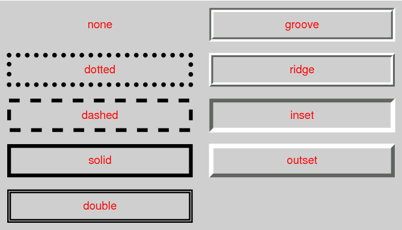
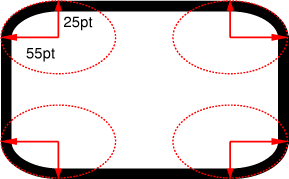

# 背景与边框 Backgrounds and Borders
- [背景与边框 Backgrounds and Borders](#背景与边框-backgrounds-and-borders)
  - [背景 Backgrounds](#背景-backgrounds)
    - [background 属性(速写没学明白)](#background-属性速写没学明白)
    - [background-color 属性](#background-color-属性)
    - [background-image 属性](#background-image-属性)
    - [background-repeat 属性](#background-repeat-属性)
    - [background-attachment 属性](#background-attachment-属性)
- [---](#---)
    - [background-position](#background-position)
    - [background-size 属性](#background-size-属性)
    - [background-origin](#background-origin)
    - [background-clip](#background-clip)
  - [边框 Borders](#边框-borders)
    - [border 属性](#border-属性)
    - [border-color 属性](#border-color-属性)
    - [border-style 属性](#border-style-属性)
    - [border-width 属性](#border-width-属性)
  - [圆角 Rounded Corners](#圆角-rounded-corners)
    - [borde-radius 属性](#borde-radius-属性)
- [---](#----1)
    - [box-shadow](#box-shadow)
    - [border-image](#border-image)
    - [border-image-source](#border-image-source)
    - [border-image-slice](#border-image-slice)
    - [border-image-width](#border-image-width)
    - [border-image-outset](#border-image-outset)
    - [border-image-repeat](#border-image-repeat)

## 背景 Backgrounds

### [background 属性(速写没学明白)](https://developer.mozilla.org/zh-CN/docs/Web/CSS/background)

应用:简写属性;，用于一次性集中定义各种背景属性，包括 `color` , `image` , `origin` 与 `size` , `repeat` 方式等等。

```css
<final-bg-layer> = <bg-image> || <position> [ / <bg-size> ]? || <repeat-style> || <attachment> || <box> || <box> || <background-color>
```

 **`background-color` 只能在 `background` 的最后一个属性上定义，因为整个元素只有一种背景颜色。**

### [background-color 属性](https://developer.mozilla.org/zh-CN/docs/Web/CSS/background-color)

应用:设置元素的背景色，属性的值为颜色值或关键字 `transparent(透明)` 二者选其一。

初始值为: `transparent(透明)`,在 CSS 中，`transparent` 是一种颜色。

`transparent` 值:

尽管在大多数情况下，没有必要使用 `transparent` 。不过如果您不希望某元素拥有背景色，同时又不希望用户对浏览器的颜色设置影响到您的设计，那么设置 `transparent` 值还是有必要的。

**元素背景的范围**

`background-color` 属性为元素设置一种颜色。这种颜色会填充元素的内容、内边距和边框区域，扩展到元素边框的外边界（但不包括外边距）。如果边框有透明部分（如虚线边框），会透过这些透明部分显示出背景色。

**在同一组背景定义中，如果背景颜色 `background-color` 和背景图 `background-image` 像都设置了，那么背景图像会覆盖在背景颜色之上。**

### [background-image 属性](https://developer.mozilla.org/zh-CN/docs/Web/CSS/background-image)

应用：为一个元素设置一个或者多个背景图像。

**绘制的图像中，图像以 z 方向堆叠的方式进行。第一个指定的图像在最上面(最靠近用户)，后续的每个图像都在前一个图像的后面。**

如果设置了`background-image`，同时也建议设置 `background-color` 用于当背景图像不可见时保持与文本颜色有一定的对比度。

>  即使图像是不透明的(opacity)，背景色在通常情况下并不会被显示，web 开发者仍然应该指定 background-color 属性。如果图像无法被加载—例如，在网络连接断开的情况下—背景色就会被绘制。

默认地，背景图像位于元素的左上角，并在水平和垂直方向上重复。

### [background-repeat 属性](https://developer.mozilla.org/zh-CN/docs/Web/CSS/background-repeat)

应用:指定背景图像在调整大小和位置后如何平铺。背景图像可以沿着水平轴，垂直轴，两个轴重复，或者根本不重复。

**属性:**

如果 `<repeat-style>` 个值有两个关键字,在双值语法中，第一个值表示水平重复行为，第二个值表示垂直重复行为。

| 属性值                              | 作用                                                         |
| ----------------------------------- | ------------------------------------------------------------ |
| repeat-x ==> `repeat no-repeat`     | 背景图像在横向上平铺                                         |
| repeat-y ==> `no-repeat repeat `    | 背景图像在纵向上平铺                                         |
| repeat ==> `repeat repeat` (默认值) | 该图像在该方向上重复，以覆盖背景绘画区域。                   |
| no-repeat ==> `no-repeat no-repeat` | 图像只放置一次，不会在此方向重复。                           |
| round ==> `round round` (CSS3)      | 当背景图像不能以整数次平铺时，会根据情况缩放图像(大概的意思) |
| space ==> `space space` (CSS3)      | 当背景图像不能以整数次平铺时，会用空白间隙填充在图像周围(大概的意思) |

> 背景图像的位置是根据 `background-position` 属性设置的。如果未规定 `background-position` 属性，图像会被放置在元素的左上角。

### [background-attachment 属性](https://developer.mozilla.org/zh-CN/docs/Web/CSS/background-attachment)

应用:定义滚动时背景图像相对于谁固定,决定背景图像的位置是在视口内固定，或者随着包含它的区块滚动。

**取值：**

| 取值         | 作用                                                         |
| ------------ | ------------------------------------------------------------ |
| fixed        | 背景图像相对于视口（viewport）固定。在没有视窗的分页媒体中，固定背景相对于页面框是固定的，因此在每一页上都复制。 |
| local (CSS3) | 背景图像相对于元素内容固定，也就是说当元素随元素滚动时背景图像也会跟着滚动，因为背景图像总是要跟着内容。 |
| scroll       | 背景相对于元素本身是固定的，不会随其内容滚动。(它有效地附加到元素的边框。） |

此属性支持多张背景图片。你可以用逗号分隔来为每一张背景图片指定不同的 `<attachment>` 属性值。每一张背景图片顺序对应相应的 attachment 属性。

# ---


### background-position

### [background-size 属性](https://developer.mozilla.org/zh-CN/docs/Web/CSS/background-size)

应用:设置背景图片大小。图片可以保有其原有的尺寸，或者拉伸到新的尺寸，或者在保持其原有比例的同时缩放到元素的可用空间的尺寸。

取值:

- `<length>` 值，指定背景图片大小，不能为负值。

- `<percentage>` 值，指定背景图片相对背景区（background positioning area）的百分比。背景区由 `background-origin` 设置，默认为盒模型的内容区与内边距，也可设置为只有内容区，或者还包括边框。如果 `attachment` 为 `fixed` ，背景区为浏览器可视区（即视口），不包括滚动条。不能为负值。

- `auto`； 以背景图片的比例缩放背景图片。
- `contain` ；缩放背景图片以完全装入背景区，可能背景区部分空白。`contain` 尽可能的缩放背景并保持图像的宽高比例（图像不会被压缩）。该背景图会填充所在的容器。当背景图和容器的大小的不同时，容器的空白区域（上/下或者左/右）会显示由 `background-color` 设置的背景颜色。

- `cover` ；缩放背景图片以完全覆盖背景区，可能背景图片部分看不见。和  `contain` 值相反，`cover` 值尽可能大的缩放背景图像并保持图像的宽高比例（图像不会被压扁）。该背景图以它的全部宽或者高覆盖所在容器。当容器和背景图大小不同时，背景图的 左/右 或者 上/下 部分会被裁剪。

**背景图片大小计算**

1. 如果指定了 `background-size` 的两个值并且不是 `auto` ：

背景图片按指定大小渲染。

2. `contain` 或 `cover` :
   保留固有比例，最大的包含或覆盖背景区。如果图像没有固有比例，则按背
   景区大小

3. `auto` 或 `auto auto` :
   图像如果有两个长度，则按这个尺寸。如果没有固有尺寸与固有比例，则按背景区的大小。如果没有固有尺寸但是有固有比例，效果同 `contain` 。如果有一个长度与比例，则由此长度与比例计算大小。如果有一个长度但是没有比例，则使用此长度与背景区相应的长度。

4. 一个为 `auto` 另一个不是 `auto`:
   如果图像有固有比例，则指定的长度使用指定值，未指定的长度由指定值与固有比例计算。如果图像没有固有比例，则指定的长度使用指定值，未指定的长度使用图像相应的固有长度，若没有固有长度，则使用背景区相应的长度。

> 注意，对于没有固有尺寸或固有比例的矢量图不是所有的浏览器都支持

单张图片的背景大小可以使用以下三种方法中的一种来规定：

使用关键词 `contain`
使用关键词 `cover`
设定宽度和高度值
当通过宽度和高度值来设定尺寸时，你可以提供一或者两个数值：

如果仅有一个数值被给定，这个数值将作为宽度值大小，高度值将被设定为 auto。

  background-size: 50%

如果有两个数值被给定，第一个将作为宽度值大小，第二个作为高度值大小。
  background-size: 25px 50px;

为了设定超过一张以上的图片尺寸时，需要提供多项数值，它们通过逗号分隔。

  background-size: 50% 25%, contain, 3em;

### background-origin

### background-clip

## 边框 Borders

### [border 属性](https://developer.mozilla.org/zh-CN/docs/Web/CSS/border)

应用:简写属性;用于设置一个或多个以下属性的值：`border-width` 、`border-style` 、`border-color` 。

注意: 虽然 `border-width` , `border-style` 和 `border-color` 简写属性接受最多 4 个参数来为不同的边设置宽度、风格和颜色，**但`boder` 属性只接受三个参数，分别是宽度、风格和颜色**，所以这样会使得四条边的边框相同。

**Borders vs. outlines**

边界（`border`）和轮廓（`outline`）很相似。然而轮廓在以下方面与边界不同：

- 轮廓不占据空间，他们在元素内容之外绘制。
- 根据规范，轮廓不必为矩形，尽管通常是矩形。

### [border-color 属性](https://developer.mozilla.org/zh-CN/docs/Web/CSS/border-color)

应用:简写属性;用于设置元素四个边框颜色： `border-top-color` 、`border-right-color` 、`border-bottom-color` 、`border-left-color` 。

如果 `border-width` 等于 `0` 或 `border-style` 设置为 `none | hidden` ，`border-color` 及其分拆独立属性将失效。

如果 `border-color` 未被定义，边框颜色将默认取当前最近的文本颜色，即 `currentColor` 。

### [border-style 属性](https://developer.mozilla.org/zh-CN/docs/Web/CSS/border-style)

**控制是否显示边框**;如果显示，则控制绘制时所用的样式（如果未被边框图像覆盖）。

应用:简写属性;用于设置元素四个边框样式。

**属性:**

| 属性值 | 作用                                                         |
| ------ | ------------------------------------------------------------ |
| none   | 与 `hidden` 关键字一样，不显示边框。除非设置了 `background-image` ，否则即使指定的值是其他值，计算出的同一侧的 `border-width` 值也将为 `0` 。在折叠表格单元格和边框的情况下，`none` 值的优先级最低：如果设置了任何其他冲突边界，则将显示该边界。 |
| hidden | 与 `none` 关键字一样，不显示边框。除非设置了 `background-image` ，否则即使指定的值是其他值，计算出的同一侧的 `border-width` 值也将为 `0` 。在表格单元格和边框折叠的情况下，隐藏值具有最高优先级：如果设置了任何其他冲突边框，则不会显示该边框。 |
| dotted | 显示一系列圆角点。点的间距不由说明书定义，而是实现特定的。点的半径是同一侧的 `border-width` 的计算值的一半。 |
| dashed | 显示一系列方头短虚线或线段。段的确切大小和长度不由规范定义，并且是特定于实现的。 |
| solid  | 显示一条直实线。                                             |
| double | 两条平行的实线，中间有一定的间距（未指定线条的粗细，但线条和间距的总和必须等于 `border-width` 。） |
| groove | 看起来好像是刻在画布上的。 （这通常是通过用比边框颜色稍亮和稍暗的两种颜色创建“阴影”来实现的。） |
| ridge  | 看起来好像它是从画布中出来的。                               |
| inset  | 显示使元素显示为嵌入的边框。它是开端的对立面。当应用于border-collapse设置为collapse的表格单元格时，此值的行为类似于 `groove` 。 |
| outset | 显示使元素显示为浮雕的边框。它是 `inset` 的对立面。当应用于`border-collapse` 设置为 `collapse` 的表格单元格时，此值的行为类似于 `ridge` 。 |

预定义边框样式的示例渲染



⚠注意: `border-style` 默认值是 `none` 或 `0` ，这意味着如果您只修改 `border-width` 和 `border-color` 是不会出现边框的。

### [border-width 属性](https://developer.mozilla.org/zh-CN/docs/Web/CSS/border-width)

应用:简写属性;设置盒子模型的边框宽度。

**属性:**

属性值: 负值无效。`thin` 、`medium` 和 `thick` 关键字分别相当于`1px` 、`3px` 和 `5px`。

注意:初始宽度为 `medium` ，但初始样式为 `none` ，因此使用的宽度为 `0` 。

##  圆角 Rounded Corners

### [borde-radius 属性](https://developer.mozilla.org/zh-CN/docs/Web/CSS/border-radius)

应用:简写属性;设置元素的外边框圆角。当使用一个半径时确定一个圆形，当使用两个半径时确定一个椭圆。这个（椭）圆与边框的交集形成圆角效果。

**取值:**

`<length>`：用长度值定义圆形半径或椭圆的半长轴，半短轴。不允许负值
`<percentage>`：用百分比定义圆形半径或椭圆的半长轴，半短轴。水平方向百分比参照元素宽度（非内容宽度），垂直方向参照元素高度。不允许负值


`border-radius` 属性的两个值值定义四分之一椭圆的半径，该四分之一椭圆定义外边框边角的形状（参见下图）。 第一个值是水平半径，第二个值是垂直半径。 如果省略第二个值，则从第一个值复制。 如果任一长度为零，则角是方形的，而不是圆形的。 水平半径的百分比指的是边框框的宽度，而垂直半径的百分比指的是边框框的高度。 负值无效。

`border-top-left-radius `: 55pt 25pt 的两个值定义了角的曲率。



`border-radius` 速记设置所有四个` border-radius` 属性。 如果在斜线前后给出值，则斜线前的值设置水平半径，斜线后的值设置垂直半径。 如果没有斜线，则这些值将两个半径设置为相等。 每个半径的四个值按左上、右上、右下、左下的顺序给出。 如果省略 `bottom-left` ，则与 `top-right` 相同。 如果省略 `bottom-right` ，则与 `top-left` 相同。 如果省略 `top-right` ，则与 `op-left` 相同。

`border-radius`属性提供 2 个参数，参数间以`/`分隔，每个参数允许设置 1~4 个参数值，第 1 个参数表示水平半径或半轴，第 2 个参数表示垂直半径或半轴，如第 2 个参数值省略未定义，则直接复制第 1 个参数值。

[参见W3C](https://w3c.github.io/csswg-drafts/css-backgrounds/#corners)

# ---

### box-shadow

### border-image

### border-image-source

### border-image-slice

### border-image-width

### border-image-outset

### border-image-repeat

