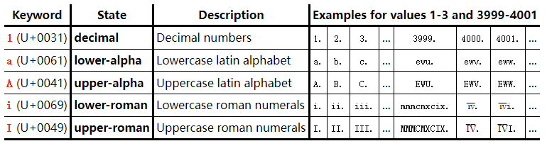

- [分组内容](#分组内容)
  - [1. p 元素](#1-p-元素)
  - [5. ol 元素](#5-ol-元素)
  - [6. ul 元素](#6-ul-元素)
  - [8. li 元素](#8-li-元素)

### 分组内容
#### 1. [p 元素](https://developer.mozilla.org/zh-CN/docs/Web/HTML/Element/p)

应用:表示文本的一个段落。该元素通常表现为一整块与相邻文本分离的文本，或以垂直的空白隔离或以首行缩进。另外，`<p>` 是[块级元素](https://developer.mozilla.org/zh-CN/docs/Web/HTML/Block-level_elements)。

> 使用CSS `margin` 属性去改变段落之间的间隙，不要在段落之间插入空的段落元素或者 `<br>` 元素。

#### 5. [ol 元素](https://developer.mozilla.org/zh-CN/docs/Web/HTML/Element/ol)

应用:表示有序列表，通常渲染为一个带编号的列表。

**属性:**

| 属性名                                                       | 作用                                                         |
| ------------------------------------------------------------ | ------------------------------------------------------------ |
| reversed 属性                                                | 反转属性是布尔属性。如果存在，则表示列表是降序列表（...，三、二、一）。如果省略该属性，则列表为升序列表（1、2、3 ...）。 |
| [start 属性](https://html.spec.whatwg.org/multipage/grouping-content.html#concept-ol-start) | （如果存在）必须是有效的整数。它用于确定列表的起始值。[MDN](https://developer.mozilla.org/zh-CN/docs/Web/HTML/Element/ol#attr-start) |
| type 属性                                                    | 列表标记的种类  `1` ,`a` , `A` , `i` , `I` 可以通过 CSS `list-style-type` 属性修改 |

**type 属性:**



#### 6. [ul 元素](https://developer.mozilla.org/zh-CN/docs/Web/HTML/Element/ul)

应用:表示一个内可含多个元素的无序列表或项目符号列表。

> 不要使用这个属性，它已经被废弃了：使用 [CSS](https://developer.mozilla.org/zh-CN/docs/Web/CSS) [`list-style-type`](https://developer.mozilla.org/zh-CN/docs/Web/CSS/list-style-type) 属性作为代替。

- `<ul>` 元素用来将**没有数字顺序**的一组数据进行分组，并且它们的数字顺序是没有意义的。举个例子，无序列表的列表项通常通过一个字符进行装饰，这些字符的形式可以是点，圆乃至方形．虽然这个字符没有直接在页面上定义，但是可以用与之相关的 CSS 对其进行操作，例如使用 `list-style-type` 属性。
- **⭐`<ol>` 和 `<ul>` 元素二者都代表一组数据，不过它们彼此是有区别的，ol 元素中的顺序是有意义的。如果想确定你到底需要使用哪一个列表元素，你可以试着去改变数据的顺序。如果想表达的语义改变了，你就需要使用 ol 元素，否则你该使用 ul 元素。**

> 一个功能有很多功能子项组成,每一个功能子项的功能和样式基本上是相同的只不过内容上可能有小小的差异,很多的功能子项组成了一个大功能.  使用 `ul>li` 组成,因为更符合天生的结构

#### 8. [li 元素](https://developer.mozilla.org/zh-CN/docs/Web/HTML/Element/li)

应用: 表示列表里的列表项。它必须包含在一个父元素里：一个有序列表 ( `<ol>` )，一个无序列表 ( `<ul>` )，或者一个菜单 ( `<menu>` )。

> 旧的规则中 `<div>` 也可以作为父元素，但是并不提倡。

**属性:**

value 属性:

这个整数型属性表明了本 `<li>` 元素在有序列表中的序号。本属性值只能用数字，即使列表使用罗马数字或字母来展示。随后的列表条目会从设置的值开始计数。value 属性对于无序列表或者菜单 (`<menu>`) 无效。

```html
<ol>
 <li>Item 1
 <li value="3">Item 3
 <li>Item 4
</ol>
```
